# OAN Dashboards — System Design

| | |
| --- | --- |
| **Owner** | Centre for Open Societal Systems (COSS), OpenAgriNet (OAN) programme |
| **Status** | Draft for review |
| **Date** | 2026-09-25 |
| **Scope** | The OAN Dashboards, and how they connect to the registry microservices (Farmer, Crop Sown, Livestock), Access to Credit (A2C), and the shared platform services |

---

## Contents

1. [Purpose and scope](#1-purpose-and-scope)
2. [Glossary](#2-glossary)
3. [Users and actors](#3-users-and-actors)
4. [System context](#4-system-context)
5. [Architecture](#5-architecture)
6. [Components](#6-components)
7. [Integration contracts](#7-integration-contracts)
8. [Sequences](#8-sequences)
9. [End-to-end lifecycles](#9-end-to-end-lifecycles)
10. [Data architecture](#10-data-architecture)
11. [Deployment architecture](#11-deployment-architecture)
12. [Security and privacy](#12-security-and-privacy)
13. [Non-functional requirements](#13-non-functional-requirements)
14. [Current state and target state](#14-current-state-and-target-state)
15. [Risks, gaps and open questions](#15-risks-gaps-and-open-questions)
16. [Appendices](#16-appendices)

---

## 1. Purpose and scope

The **OAN Dashboards** give OpenAgriNet programme staff one analytics screen per domain:

| Dashboard | What it shows | Where the data comes from today |
| --- | --- | --- |
| **Registries** | Farmer overview (registrations, demographics, land tenure, geographic coverage, map drill-down from region to kebele), plus Crop and Livestock views | Farmer overview: the **farmer registry dashboard service**. Crop and Livestock views: the transitional database |
| **Catalogs** | National reference data: crops and varieties, livestock breeds, seed demand, administrative hierarchy, connected registries | Transitional database |
| **Access to Credit** | Credit pipeline: loan applications, consent outcomes, providers, products, registry data sharing | Transitional database (sample data) |
| **DevOps** | Platform health: instances, pipelines, API traffic, databases, incidents | Transitional database (sample data) |

This document describes:

- how the dashboards are built, and how they get data from each system
- the users of each system, and the actors that exchange data with them
- the sequences for the main interactions
- the end-to-end lifecycle of the data, from a farmer's registration to a figure on a dashboard, and of a loan request through A2C
- how the pieces are deployed, secured and operated
- what is live today, what is transitional, and the target architecture

The reference implementation is the **farmer registry dashboard service**
(`farmer-registry-dashboard-api`). The other registries and A2C are expected to follow the same
pattern.

### 1.1 Sources

This document is based on the code and documentation in these repositories. Development happens
on forks, but the systems belong to COSS, so this document uses the COSS repository names.

| System | COSS repository | Branch reviewed | Commit |
| --- | --- | --- | --- |
| OAN Dashboards (UI + BFF) | `Centre-for-Open-Societal-Systems/oan_dashboards` | `feature/dashboard-api-integration` (fork `asmitonweb/oan_dashboards`) | `86753ab` |
| Farmer registry dashboard service | `Centre-for-Open-Societal-Systems/farmer-registry-dashboard-api` | `feature/dashboard-api` (fork `asmitonweb/coss-farmer-registry-dashboard-api`) | `6202e48` |
| Farmer Registry | `Centre-for-Open-Societal-Systems/farmer-registry` | `feature/dashboard-api-cicd` | `e06a002` |
| Crop Sown Registry | `Centre-for-Open-Societal-Systems/cropsown-registry` (fork `asmitonweb/cropsown-regsitry`) | default | `1e2fee1` |
| Livestock Registry | `Centre-for-Open-Societal-Systems/livestock-registry` (fork `asmitonweb/livestock-registry`) | default | `5e25e93` |
| A2C backend | `Centre-for-Open-Societal-Systems/oan_a2c` | default | `5efa326` |
| A2C web frontend | `Centre-for-Open-Societal-Systems/OAN-Access-To-Credit-System` | default | `f4557c6` |

Statements marked **(verified)** were checked against the code. Statements marked **(proposed)**
describe the target design and are not built yet.

---

## 2. Glossary

| Term | Meaning |
| --- | --- |
| **OAN** | OpenAgriNet, the agricultural digital public infrastructure programme |
| **COSS** | Centre for Open Societal Systems |
| **OpenG2P registry platform** | The platform (gen2) the registries are built on: staff portal, partner API, Celery workers, approval workflow, ID generator. Each registry is a thin *extension* on top of it |
| **Registry** | A system of record for one domain: Farmer, Crop Sown, Livestock |
| **Register** | A table of records inside a registry, for example `g2p_register_farmers` |
| **Commons / commons-services** | Shared platform releases: PostgreSQL, Redis, MinIO, Keycloak, IAM, Master Data, Partner Management, Consent Manager, AWE, audit manager, key manager |
| **AWE** | Approval Workflow Engine. Runs the multi-stage approval of registry records |
| **Dashboard service** | A small read-only API, one per registry, that returns aggregate chart data to the dashboards over one shared HTTP contract |
| **BFF** | Backend-for-frontend. The dashboards' own API (Elysia, mounted under `/api` in the Next.js process) |
| **Chart ID** | The name of one chart's data set, for example `farmerKpis`. Each chart ID is served by exactly one source |
| **Reporting view** | A materialized view in a registry database that flattens the register for reporting (`fr_rpt_farmer`, `fr_rpt_land`) |
| **Transitional database** | A PostgreSQL database that the dashboards still query directly for charts that have no dashboard service yet. To be removed |
| **P-code** | An administrative unit code (HDX/OCHA), for example `ET04` (Oromia), `ET0410`, `ET041016`. The join key between registry data and map boundaries |
| **A2C** | Access to Credit: the marketplace that links farmers, Development Agents and banks, with consent-based sharing of registry data |
| **DA** | Development Agent: a Ministry of Agriculture / ATI field officer |
| **Fayda / FAN** | Ethiopia's national digital ID, and its Fayda Alias Number |
| **ODK** | Open Data Kit, used by enumerators for field collection |

---

## 3. Users and actors

### 3.1 People

| User | System they use | What they do | How they authenticate |
| --- | --- | --- | --- |
| **Programme leadership and analysts** (MoA, ATI, COSS) | OAN Dashboards, usually embedded in a portal | View national and regional statistics, filter by geography, farming type and record status, drill down on the map, export panels as PNG, PDF or CSV | None in the dashboards. Access is controlled by the embedding portal or the ingress (see [§12](#12-security-and-privacy)) |
| **Enumerators** | ODK Collect on a tablet | Collect farmer profiles in the field | ODK Central accounts |
| **Registry officers** (intake, review, approval) | Registry staff portal (farmer, crop sown, livestock) | Review intake, approve or reject registrations, search and update records | Keycloak realm `staff`, roles resolved through IAM |
| **Approvers** | Staff portal, with AWE | Complete approval stages (two stages for farmer; Kebele → Woreda → Zone → Region for livestock) | As above |
| **Development Agents (DA)** | A2C web app (and mobile) | Capture leads, schedule field visits, capture farmer consent through Fayda OTP, file loan applications | A2C JWT (Keycloak RS256 planned) |
| **Bank Agents and Bank Admins** | A2C web app | Onboard their bank, publish loan products, define their approval pipeline, review and decide applications. Can only see their own bank's data | A2C JWT, scoped to one Participating Bank |
| **Farmers** | A2C self-service (B2C) | Browse loan products, start and submit applications, give consent | A2C JWT (`A2C Farmer` role) |
| **A2C Administrators** | A2C | Governance: taxonomy, cancellations, password resets | A2C JWT |
| **Platform and DevOps engineers** | Jenkins, Kubernetes, Helm, the DevOps dashboard | Build, deploy, monitor, roll back | Jenkins and cluster credentials |

### 3.2 Systems that act as clients

| Actor | Talks to | Purpose |
| --- | --- | --- |
| **ODK Central** | Farmer registry (`/api/v1/farmer-registry/odk/webhook`), or a sync job that calls the partner API | Push field submissions into intake |
| **Partner systems** | Registry partner API (`POST /partner/ingest_data`) | Bulk or system-to-system ingestion |
| **OpenG2P consent service** | A2C inbound webhook (`receive_consent_data`) | Deliver the farmer's approved data after consent |
| **Telco / IVR gateway** | A2C inbound webhook (`lead_inbound`) | Create leads from missed calls, IVR or SMS |
| **OAN Dashboards BFF** | Registry dashboard services | Fetch aggregate chart data |

---

## 4. System context

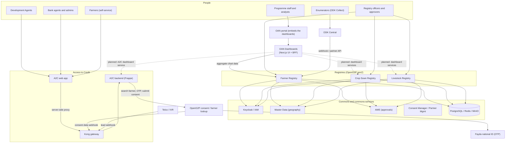

The dashboards are a **read-only consumer**. They never write to a registry or to A2C, and they
never see personal data: every source returns aggregates only.

---

## 5. Architecture

### 5.1 Principles

1. **One dashboard service per source system.** Each registry (and, in the target state, A2C)
   publishes its statistics through its own read-only dashboard service. The service runs next to
   its system, is the only component that holds that system's database credentials, and returns
   aggregates only.
2. **The dashboards never touch a registry database.** The BFF knows each service's URL and the
   chart IDs it serves, and nothing else.
3. **One contract for every service.** `GET /api/v1/charts/<chartId>?<filters>` returns a JSON array
   of rows. Adding a registry is configuration, not new integration code.
4. **Cache at the edge of the dashboards.** Registry figures come from reporting views refreshed on a
   schedule, so the BFF caches each chart and filter combination. Load on a registry does not grow
   with the number of viewers.
5. **The browser only talks to the BFF.** Dashboard services have no public ingress.
6. **Codes, not labels.** Services return registry codes (`FEMALE`, `UNDER_25`, `CROP_SHARE`). The
   dashboards label them in one place.

### 5.2 Container view

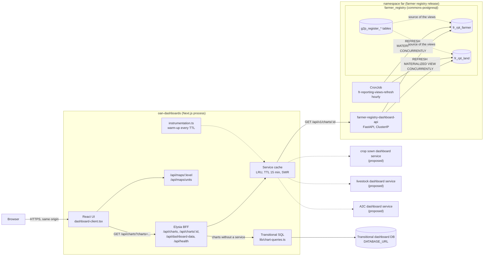

### 5.3 How a chart ID is served (verified)

`executeChartQuery` in `server/elysia-app.ts` routes every chart ID:

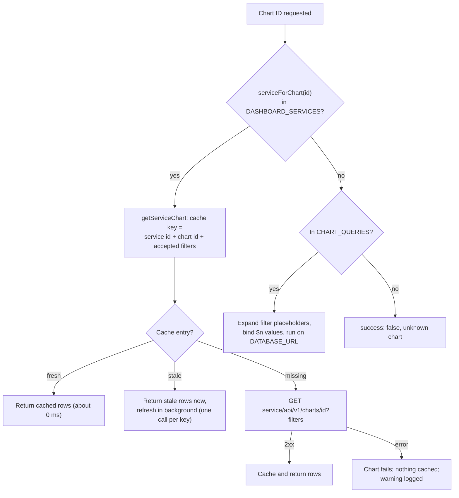

---

## 6. Components

### 6.1 OAN Dashboards (`oan_dashboards`)

**Stack:** Next.js 16 (App Router, React 19), Elysia BFF mounted at `/api` in the same process,
Recharts, Tailwind CSS 4, shadcn/ui on Radix. Built with Node 20, run with Bun.

| Area | Location | Responsibility |
| --- | --- | --- |
| Page shell | `app/page.tsx`, `components/dashboard-client.tsx` | Filter state and dashboard switch; dashboards loaded with `next/dynamic` |
| Filter sidebar | `components/global-filters-sidebar.tsx` | Dashboard selector; cascading Region → Zone → Woreda → Kebele; Farming Type; Record Status; Type of Farmer (Credit Provider on A2C) |
| Registries dashboard | `farmer-overview-dashboard.tsx`, `crop-sown-dashboard.tsx`, `livestock-dashboard.tsx` | Overview (default), plus Crop and Livestock views selected by farming type |
| Other dashboards | `catalogs-dashboard.tsx`, `a2c-dashboard.tsx`, `devops-dashboard.tsx` | |
| Map | `ethiopia-map.tsx`, `lazy/map-when-visible.tsx` | Loaded when scrolled into view. Clicking a unit sets a geography filter |
| Map geometry | `app/api/maps/[level]`, `app/api/maps/units` | Region, zone and woreda boundaries (Brotli TopoJSON in `public/maps`) served as GeoJSON; the list of woredas with their zone and region P-codes, used as the coverage denominator |
| Code labels | `components/registry/registry-data.ts` | `AGE_BANDS`, `ageBandLabel()`, `tenureLabel()`. The only place codes are turned into labels |
| Export | `components/registry/export-button.tsx` | PNG, PDF or CSV of the visible panels |
| Data hook | `hooks/use-data.ts` (`useChartGroupData`) | One batched request per panel group |
| BFF | `server/elysia-app.ts` | Filter parsing, chart routing, batch endpoints |
| Service map and cache | `server/dashboard-services.ts` | `DASHBOARD_SERVICES`, `getServiceChart`, `warmDashboardServices` |
| Warm-up | `instrumentation.ts` | Loads every service's unfiltered charts at start-up and every TTL |
| Transitional SQL | `lib/chart-queries.ts` | Parameterised SQL for charts without a service |

**BFF endpoints (verified):**

| Endpoint | Purpose |
| --- | --- |
| `GET /api/health` | Liveness (`{"status":"ok"}`) |
| `GET /api/charts?charts=a,b,c&<filters>` | Batch: runs every chart in parallel; one failure does not fail the batch |
| `GET /api/charts/:chartId?<filters>` | One chart |
| `GET /api/dashboard-data`, `/api/dashboard/{general,demography,socio-economic,land,admin}` | Older batch endpoints over the transitional path |
| `GET /api/filter-options`, `GET /api/locations` | Filter values and the cascading location lists (transitional database, `g2p_region/zone/woreda/kebele`) |
| `GET/POST /api/data`, `POST /api/data/export` | Legacy data-service endpoints |
| `GET /api/maps/:level`, `GET /api/maps/units` | Map geometry and boundary units |

### 6.2 Farmer registry dashboard service (`farmer-registry-dashboard-api`)

**Stack:** Python 3.11, FastAPI, asyncpg, gunicorn with Uvicorn workers.

| Module | Responsibility |
| --- | --- |
| `app/main.py` | App factory; asyncpg pool created in the lifespan; CORS; `GET /health` (runs `SELECT 1`) |
| `app/core/config.py` | Settings (pydantic-settings): `DATABASE_URL`, `API_V1_STR`, `ALLOWED_ORIGINS`, `GEO_LEVEL_TOTALS`, `PROJECT_NAME` |
| `app/api/filters.py` | `ChartFilters` (query parameters) and `build_where_clause`, the one place user input becomes SQL. Every value is bound as `$n` |
| `app/api/routes/charts.py` | One handler per chart, each running one aggregate query over a reporting view |
| `tests/` | Contract tests pin each chart's response keys; filter and SQL-injection tests |

Request lifecycle: bind query string to `ChartFilters` → `build_where_clause(filters, view=…)` →
acquire a pooled connection → run one aggregate query → return a JSON array. The service holds no
state beyond its pool and does not cache (the BFF does).

Design rules:

- Reads **only** `fr_rpt_farmer` (one row per farmer) and `fr_rpt_land` (one row per parcel), never
  the register tables.
- Head counts come from `fr_rpt_farmer`. Area by a parcel attribute (tenure, land use) comes from
  `fr_rpt_land` joined to `fr_rpt_farmer`, so every filter applies to the **owning farmer**.
- Geography is matched **by position** (`geo_1_id` … `geo_4_id`) and accepts either `ET04` or
  `region-ET04`, so it works for any country's hierarchy.
- When `recordState` is absent, only `ACTIVE` records are counted (except `farmersByRecordState`).

### 6.3 Farmer Registry (`farmer-registry`)

A thin extension (`farmer-extension/`) of the OpenG2P registry platform. The platform provides the
runnable images and the `openg2p-registry` Helm chart; this repository adds the farmer domain.

| Component | Role |
| --- | --- |
| `staff-portal-ui` / `staff-portal-api` | Officer portal and API: intake, review, approval, search. Farmer domain logic, deduplication, ODK webhook |
| `partner-api` | Ingestion gateway for partners (`POST /partner/ingest_data`) |
| `celery-worker`, `celery-beat` | Classification, Jinja2 rendering of inbound messages, bulk intake creation, periodic tasks |
| `db-seed` | Schema metadata, AWE policy, DCI templates, sample data (Helm hook) |
| `id-generator` | Functional IDs (the farmer ID) |
| `dashboard-api` | The farmer registry dashboard service (§6.2), part of the same Helm release |
| Reporting views Job + CronJob | Creates `fr_rpt_*` (post-upgrade hook, weight 45) and refreshes them hourly (`0 * * * *`) in dependency order, land first |

**Registers:** `Farmer` (`g2p_register_farmers`), `Household`, `HouseholdMember`, with supporting
tables `Land`, `Crop` (per land parcel), `Livestock`, `FarmInputs`, `MembershipDetails`,
`PovertyScore`. Every table has a `*_history` twin.

### 6.4 Crop Sown and Livestock Registries

Both follow the farmer registry's build model (thin extension on the OpenG2P platform, wrapper Helm
chart, Jenkins → ECR → Helm).

| | Crop Sown Registry | Livestock Registry |
| --- | --- | --- |
| Hub record | `CropSown`: one plot, with Planning, Cultivation, Sowing, Production, Harvest, Infestation, Cluster lines | `Livestock` holding, with Animal, HealthEvent, Vaccination, VitalEvent, Breeding, VaccineSchedule, ImportBatch, AuditLog |
| Link to farmers | Carries `farmer_uuid`, `farmer_id`, `fayda_fan_id`, `farmer_name`. The Farmer Registry remains the system of record for people | Same, plus a minimal `Farmer` register holding the identity needed to attach livestock |
| Approval | AWE policy seeded by the extension | Four levels: Kebele → Woreda → Zone → Region |
| Own analytics | `dashboard-ui/`: a Next.js app behind the staff portal's Dashboard button, reading the registry database directly | `dashboard-ui/`: same pattern |
| OAN Dashboards integration | **None yet.** The Crop view reads the transitional database | **None yet.** The Livestock view reads the transitional database |

### 6.5 A2C backend (`oan_a2c`)

A Frappe application (Python, MariaDB, Redis) exposing about 95 REST endpoints in ten domains:
Identity & Access; Bank Onboarding & Administration; Bank Cataloging; Catalog Discovery;
Applications (farmer self-service); CRM (leads and field operations); Loan Underwriting; Consent
Management; Notifications; Inbound Webhooks.

| Concern | Design (verified) |
| --- | --- |
| Authentication | Stateless JWT (HS256, 15-minute access token, `kid` key rotation). Refresh tokens are hashed in `A2C User Refresh Token` and rotated on every use. Keycloak RS256 tokens with just-in-time user provisioning and role sync are the documented target ("dual-mode" middleware) |
| Authorization | Frappe roles and User Permissions. Bank users are scoped to one `Participating Bank` by query- and document-level hooks (`bank_scope_query`, `bank_scope_doc`) |
| Gateway | Kong, DB-less and declarative (`kong.yml`, generated from the OpenAPI contract). JWT for end-user routes, `key-auth` for the two inbound webhooks, per-tier rate limits |
| Consent | `openg2p_client.py` calls OpenG2P: `/consent/search_farmer`, `/consent/fayda/request_otp`, `/consent/fayda/verify_otp`, `/api/consent/submit_consent`, `/api/consent/reasons`, `/api/consent/allowed_data_fields`. It uses a session login (`/web/session/authenticate`), a cached session cookie and a circuit breaker. The approved data comes back asynchronously on `webhook_consent_data.receive_consent_data` |
| Response envelope | `{status, message, data, meta, pagination}` or `{status: "error", code, details}` |

**Key DocTypes:** `A2C Lead`, `A2C Farmer Profile`, `A2C Credit Information`,
`A2C Consent Request` (+ `A2C Consent Data`), `A2C Loan Application` (+ audit events and term
snapshot), `A2C Visit Schedule`, `A2C Participating Bank`, `A2C Loan Product`,
`A2C Loan Status Stage`, `A2C Saved Product`.

**State machines:**

| Record | States |
| --- | --- |
| Lead | `Active`, `Verified` → terminal `Processed`, `Granted`, `Rejected`, `Dormant` |
| Consent request | `Draft` → `Pending OTP` → `OTP Verified` → `Approved` / `Rejected` / `Failed` |
| Loan application (status field) | `Draft`, `Processing`, `Approved`, `Rejected` |
| Loan application (workflow archetype, platform-owned) | `Active` → Submit → `In Transition` → Complete / Reject → `Completed` / `Rejected`; `Cancelled` (admin only) |
| Loan application (bank pipeline, tenant-owned) | Bank-defined `A2C Loan Status Stage` rows, each mapped to one archetype state |
| Visit schedule | `Scheduled` → `Completed` / `Cancelled` / `Missed` |

### 6.6 A2C web frontend (`OAN-Access-To-Credit-System`)

Next.js (App Router), Redux Toolkit, feature modules `auth`, `leads`, `new-lead`, `loans`,
`new-loan`. The browser never calls the backend directly: `src/app/api/proxy/[...path]` forwards
requests to `API_BASE_URL`, injecting `Authorization: Bearer` from the `auth_token` cookie, with a
CSRF check on mutating verbs. `src/proxy.ts` sets a per-request CSP nonce and redirects
unauthenticated users to `/login`.

---

## 7. Integration contracts

### 7.1 Dashboard service contract (all registries)

| Item | Contract |
| --- | --- |
| Chart endpoint | `GET /api/v1/charts/<chartId>?<filters>` |
| Health endpoint | `GET /health` → `200 {"status":"ok"}` when the service and its database answer |
| Filters | `region`, `zone`, `woreda`, `kebele` (administrative codes, levels 1–4), `farmingType` (case-insensitive), `recordState` (defaults to active records). `all` or absent means no filter. Unknown parameters are ignored |
| Response | `200` with a JSON **array** of row objects, `[]` when empty. Counts are integers, measures are numbers, categories are registry codes. No envelope |
| Errors | `404` unknown chart, `5xx` failure. The BFF treats any non-2xx as a failed call |
| Stability | Response keys are a contract with the UI and are pinned by tests. Adding keys is compatible. Renaming or removing keys, changing types or defaults needs a coordinated change or `/api/v2` |
| Data | Aggregates only. No names, identifiers, contact details or coordinates |

### 7.2 Registering a service in the dashboards

```ts
// server/dashboard-services.ts
{
  id: 'farmer-registry',                          // cache keys and logs
  urlEnv: 'FARMER_REGISTRY_DASHBOARD_API_URL',    // variable with the base URL
  filters: [...GEO_FILTERS, 'farmingType', 'recordState'],
  charts: ['farmerKpis', 'farmersByRegion', /* … */],
}
```

A chart ID belongs to exactly one service. Only the filters a service declares are forwarded, so
other filters (for example `farmerType`) do not split its cache. A service whose URL variable is
not set is treated as unavailable: its charts report an error and everything else keeps working.

### 7.3 Farmer registry chart catalogue (verified)

| Chart ID | Fields | Source view | Notes |
| --- | --- | --- | --- |
| `farmerKpis` | `total_farmers, female_farmers, male_farmers, total_land_size, avg_farm_size, farmers_with_owned_land, household_heads, farmers_with_id, farmers_without_id` | `fr_rpt_farmer` | `household_heads` is always 0 |
| `farmersByRegion` | `region, region_code, farmers` | `fr_rpt_farmer` | `region_code` joins to map features |
| `farmersByZone` / `ByWoreda` / `ByKebele` | `<level>, <level>_code, farmers` | `fr_rpt_farmer` | Map drill-down; `farmersByWoreda` also drives coverage |
| `farmersByFarmerId` | `id_status, farmers` | `fr_rpt_farmer` | From the functional record id |
| `farmersByGender` | `gender, farmers` | `fr_rpt_farmer` | |
| `farmersByType` | `farming_type, farmers` | `fr_rpt_farmer` | Type of the farmer's largest parcel |
| `farmersByAgeAndGender` | `age_group, gender, farmers` | `fr_rpt_farmer` | Bands `UNDER_25, 25_34, 35_49, 50_64, 65_PLUS, UNKNOWN` (registry policy) |
| `farmersByEducation` | `education, farmers` | `fr_rpt_farmer` | |
| `farmersByRecordState` | `record_state, farmers` | `fr_rpt_farmer` | Covers every status unless filtered |
| `landTenureSplit` | `ownership_type, parcels, area` | `fr_rpt_land` ⋈ `fr_rpt_farmer` | Per parcel, filtered by owner; active parcels only |
| `registryTrendByMonth` | `period, farmers, total_area, owned_area` | `fr_rpt_farmer` | `YYYY-MM` |
| `registryCoverage` | `<level>s_covered, <level>s_total` | `fr_rpt_farmer` + `GEO_LEVEL_TOTALS` | Totals are configuration |
| `farmersByPsnpStatus`, `farmersByImportStatus` | — | — | Always `[]` (placeholders) |

### 7.4 BFF response to the browser

```json
{
  "success": true,
  "data": {
    "farmerKpis": { "chartName": "farmerKpis", "success": true, "data": [ { "total_farmers": 195 } ], "error": null, "executionTime": 0 },
    "a2cKpis":    { "chartName": "a2cKpis",    "success": false, "data": [], "error": "…", "executionTime": 12 }
  },
  "summary": { "total": 2, "successful": 1, "failed": 1, "totalExecutionTime": 12 },
  "filters": { "region": "ET04" },
  "timestamp": "2026-09-25T00:00:00.000Z"
}
```

`executionTime` tells you how a chart was served: about 0–1 ms from the cache, a few hundred ms for
a service call, the query time for transitional SQL.

### 7.5 Other integration points

| From → To | Interface | Auth |
| --- | --- | --- |
| ODK Central → Farmer Registry | `POST /api/v1/farmer-registry/odk/webhook`, or `odk/sync_from_central.py` (OData pull) → `POST /partner/ingest_data` | Webhook URL / partner API key |
| Registries → Master Data | Geography hierarchy (region → kebele); also read by the reporting-views jobs | In-cluster, DB secret `master-data` |
| Registries → AWE | Approval requests and HMAC-signed callbacks (`farmer-registry-awe-callback-hmac`) | HMAC |
| Registries → Keycloak / IAM | OIDC login for staff; registry tile, roles and permissions registered by the `iam-register` hook | OIDC |
| A2C web → A2C backend | Server-side proxy → Kong → Frappe REST (`/api/method/oan_a2c.*`, REST facade `/v1/…`) | Bearer JWT |
| A2C backend → OpenG2P | JSON-RPC over HTTPS: farmer search, Fayda OTP, consent submit | Service account session |
| OpenG2P → A2C backend | `receive_consent_data` webhook (WebSub-style event with `consent`, `farmer`, `selected_data`) | Kong `key-auth`, then a Frappe API key injected by Kong |
| Telco / IVR → A2C backend | `lead_inbound` webhook, deduplicated on `external_id` | Kong `key-auth` |

---

## 8. Sequences

### 8.1 Dashboard opens (warm cache)

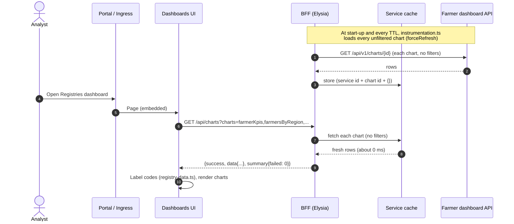

### 8.2 Filter change (cache miss)

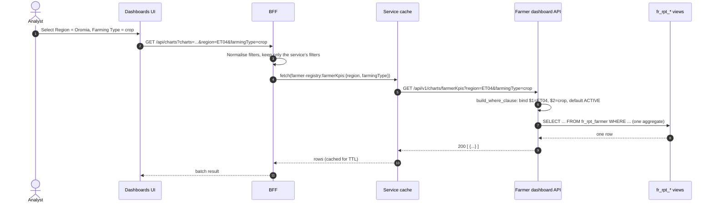

### 8.3 Expired entry, and a service outage

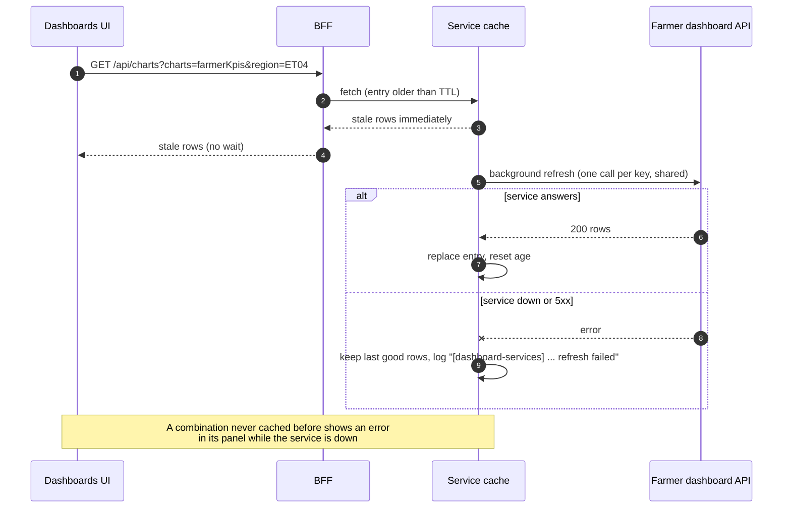

### 8.4 Map drill-down and geographic coverage

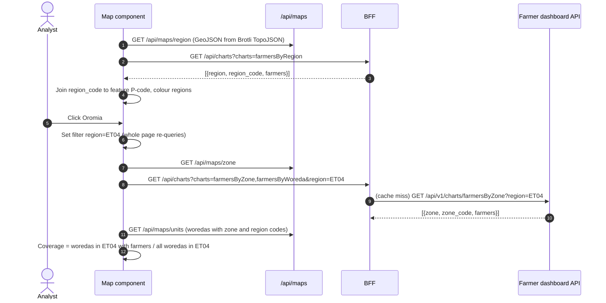

### 8.5 Farmer registration to dashboard figure

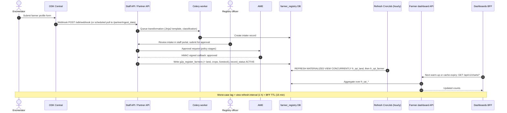

### 8.6 A2C: Development Agent lead to loan decision

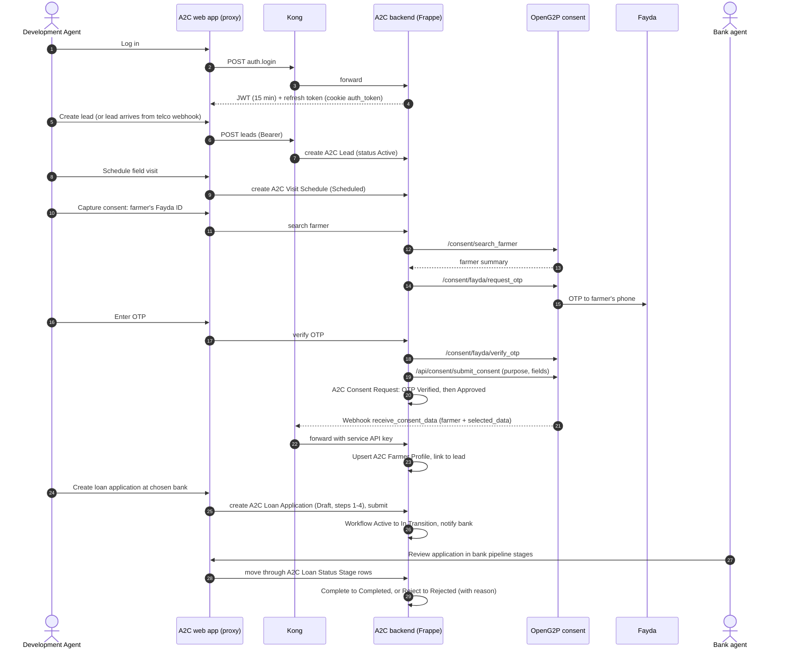

### 8.7 A2C: consent data webhook

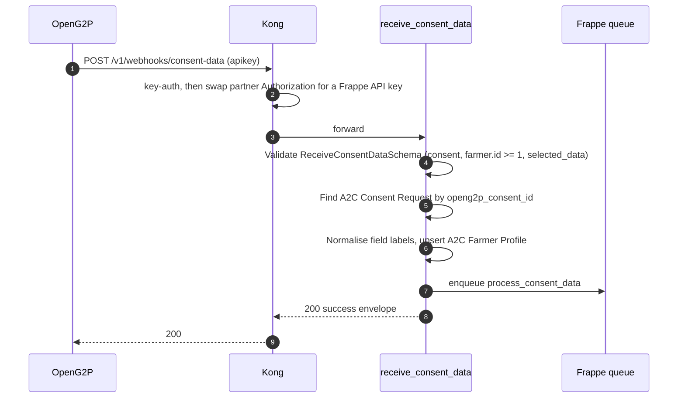

### 8.8 Build and deployment of the farmer dashboard service

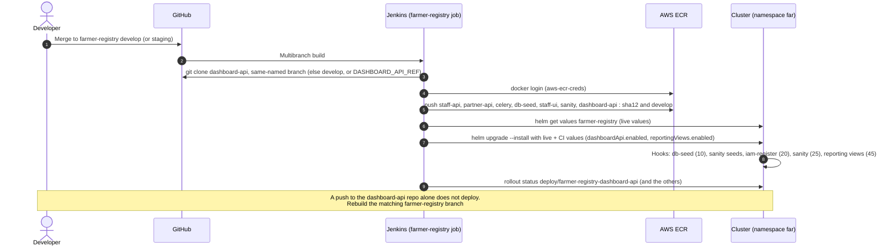

---

## 9. End-to-end lifecycles

### 9.1 Registry data lifecycle

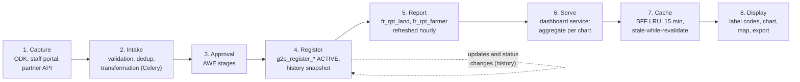

| Stage | Owner | Latency added | Failure behaviour |
| --- | --- | --- | --- |
| Capture → Register | Registry | Minutes to days (human approval) | Intake stays pending |
| Register → Report | Registry refresh CronJob | Up to 1 hour | Views keep the last snapshot; `concurrencyPolicy: Forbid` prevents pile-up |
| Report → Serve | Dashboard service | < 1 s per query | `/health` fails, pod leaves the Service; BFF keeps serving cached rows |
| Serve → Display | Dashboards BFF | Up to 15 minutes | Stale rows are served; uncached combinations show a panel error |

**Freshness budget:** the worst-case lag between an approval and the dashboard is about
**75 minutes** (1-hour refresh + 15-minute cache). To publish sooner after a bulk load, run the
refresh job (`kubectl create job --from=cronjob/farmer-registry-fr-reporting-views-refresh`) and
restart the dashboards or wait one cache period.

**Record status:** a record counts on the dashboards only while `record_status = 'ACTIVE'`, unless
the user picks another status in the Record Status filter.

### 9.2 Farmer credit lifecycle (A2C)

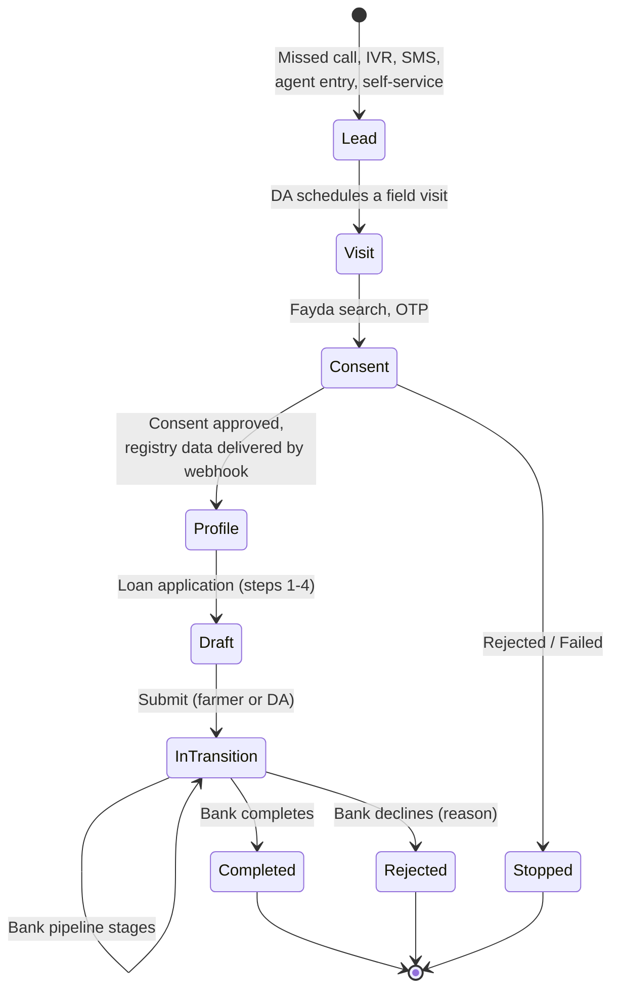

The A2C dashboard is meant to show this funnel: providers, consent outcomes, applications by status
and region, loan products, amounts, trend, data shares and their faults, and decline reasons.
Today it shows **sample data** from the transitional database (see [§14](#14-current-state-and-target-state)).

### 9.3 Release lifecycle

| Step | Farmer registry and its dashboard service | OAN Dashboards | A2C |
| --- | --- | --- | --- |
| Source | `farmer-registry` + `farmer-registry-dashboard-api` (same branch name) | `oan_dashboards` | `oan_a2c`, `OAN-Access-To-Credit-System` |
| Build | Jenkins multibranch → ECR `openg2p/farmer-registry/<image>:<sha12>` | Docker two-stage image (Node build, Bun runtime) | Jenkinsfile / Jenkinsfile.main in each repo |
| Deploy | `helm upgrade farmer-registry` in `far` (dev on `develop`, staging on `staging`) | Deployment + ClusterIP behind the ingress or portal | Frappe bench; frontend container with `API_BASE_URL`; Kong via decK |
| Verify | Rollout status, hook Job outcomes, `curl /health` and `/api/v1/charts/farmerKpis` in the cluster | `GET /api/charts?charts=farmerKpis` → `summary.failed = 0` | Test suite, Postman collection |
| Roll back | `helm rollback farmer-registry <rev>`, or `dashboardApi.enabled: false` | Previous image | Previous image / bench migrate |

**Change order for a new chart:** implement and test it in the dashboard service → deploy the
service → add the chart ID to `DASHBOARD_SERVICES` and label its codes → deploy the dashboards →
delete the transitional SQL for that ID.

---

## 10. Data architecture

### 10.1 Farmer registry reporting views

The views flatten a three-level tree into two grains:

```
farmer ──< land ──< crop / livestock / farm_inputs
       └──< membership_details, score
```

| View | Grain | Key columns used by the dashboards |
| --- | --- | --- |
| `fr_rpt_farmer` | One row per farmer | `farmer_id`, `geo_1..geo_5`, `geo_1_id..geo_5_id`, `gender`, `is_female`, `age_band`, `education_level`, `record_status`, `main_farming_type`, `main_tenure`, `total_land_ha`, `owns_any_parcel`, `parcel_count`, `crop_count`, `livestock_head_total`, cooperative membership flags, `registration_date` |
| `fr_rpt_land` | One row per parcel | `land_ownership_type`, `farming_type`, `land_size_ha`, owner-operated flag, parcel geography, `record_status` |

Properties:

- **Country-agnostic.** Geography is unpacked from `geo_code_hierarchy_json` by position, so any
  hierarchy depth and naming works (`fr_rpt_geo_levels` carries the level labels).
- **Hectares.** `land_size_ha` normalises free-text sizes and units. Bad values become `NULL`
  instead of failing the refresh.
- **Refresh order.** Land first, then farmer, resolved from the catalogue.
  `REFRESH … CONCURRENTLY` means readers are never blocked.

### 10.2 Geography

| Level | Parameter | Example code | Map boundary |
| --- | --- | --- | --- |
| 1 | `region` | `ET04` | Yes |
| 2 | `zone` | `ET0410` | Yes |
| 3 | `woreda` | `ET041016` | Yes |
| 4 | `kebele` | registry code | No (list view only) |

The registry stores level value ids as `<level>-<code>` (`region-ET04`). The dashboard service
accepts both forms. P-codes are the join key between the registry, the map TopoJSON and the A2C
data. The source of the hierarchy is Master Data.

### 10.3 A2C: dashboard schema compared with the backend

The dashboards' A2C panels read a transitional schema (`data/a2c/01_create_a2c.sql`, **sample
data**). It is modelled on the flow *credit provider → consent request → loan application →
registry data share*. The real records are in the Frappe backend:

| Dashboard table (transitional) | A2C backend source (proposed mapping) | Notes |
| --- | --- | --- |
| `a2c_credit_provider` | `A2C Participating Bank` | Status `ACTIVE` / `ONBOARDING` |
| `a2c_farmer` (with region, zone, woreda P-codes) | `A2C Farmer Profile` / `A2C Lead` location | The backend stores region, zone and woreda as names from select lists. A P-code mapping is needed |
| `a2c_consent_request` | `A2C Consent Request` | Status vocabularies differ (see §15) |
| `a2c_loan_application` | `A2C Loan Application` + `A2C Loan Status Stage` | Dashboard uses `IN_PROGRESS/PENDING/APPROVED/DECLINED`. Backend uses `Draft/Processing/Approved/Rejected` and the archetype `Active/In Transition/Completed/Rejected/Cancelled` |
| `a2c_registry_data_share` | Consent webhook deliveries (`websub_delivered`, `websub_delivered_at` on `A2C Consent Request`) | Delivered / failed, with fault reason |

The A2C panels already share one scope (`A2C_SCOPE` CTEs), so a provider or location filter
narrows every panel in the same way. An A2C dashboard service should keep that behaviour.

---

## 11. Deployment architecture

### 11.1 Topology

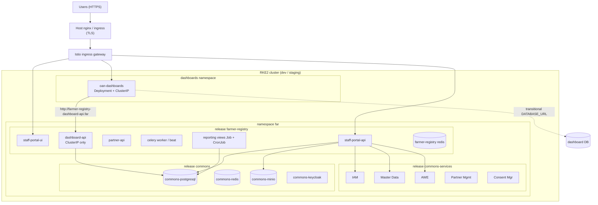

### 11.2 Environments

| Environment | Cluster | Deployed from | Jenkins credential |
| --- | --- | --- | --- |
| dev | RKE2 "gen2 dev" | `develop` | `gen2-dev-kubeconfig` |
| staging | EC2 `farmer-registry-development.oanstaging.com` | `staging` | `staging-farmer-kubeconfig` |

Both use namespace `far` and release `farmer-registry`. Deploys run on the Jenkins node
`vpn-agent2`. Images are in ECR (`ap-south-1`) under `openg2p/farmer-registry/*`.

### 11.3 Configuration

| System | Variable / value | Default | Purpose |
| --- | --- | --- | --- |
| Dashboards | `FARMER_REGISTRY_DASHBOARD_API_URL` | — | Base URL of the farmer dashboard service, for example `http://farmer-registry-dashboard-api.far` |
| Dashboards | `<REGISTRY>_DASHBOARD_API_URL` | — | One per additional service |
| Dashboards | `DASHBOARD_CACHE_TTL_SECONDS` | `900` (min 60) | Cache lifetime and warm-up interval |
| Dashboards | `DATABASE_URL` | — | Transitional database. Removed when the last transitional chart moves |
| Dashboards | `FARMER_DATABASE_URL` | — | Legacy; leave unset |
| Dashboard service | `DATABASE_URL` | required | Registry database DSN (read-only role recommended) |
| Dashboard service | `GEO_LEVEL_TOTALS` | `{}` | National unit counts for `registryCoverage` |
| Dashboard service | `ALLOWED_ORIGINS` | `[]` in Helm | CORS (defence in depth) |
| Helm | `dashboardApi.workers` / `replicas` | `2` / `1` | Each worker holds a 10-connection pool |
| Helm | `analytics.reportingViews.refreshSchedule` | `0 * * * *` | View refresh |
| A2C web | `API_BASE_URL` | — | A2C backend (through Kong) |
| A2C backend | `jwt_secrets`, `jwt_current_kid`, `encryption_key`, `secret_key`, `openg2p_base_url`, `openg2p_db`, `openg2p_username`, `openg2p_password` | — | `site_config.json` |

Secrets come from the platform's secret store (Kubernetes Secrets). None of these variables may use
the `NEXT_PUBLIC_` prefix.

---

## 12. Security and privacy

| Threat | Control | Status |
| --- | --- | --- |
| Personal data exposure through the dashboards | Services return aggregates only; no names, IDs, contacts or coordinates | Verified in the farmer service |
| Re-identification from small counts (one kebele plus narrow filters) | Minimum cell size (suppress or round counts below 5) in each service | **Proposed**; required before any public release |
| SQL injection | The browser sends only chart IDs and filter values. Services bind every value as a parameter (`build_where_clause`); column names only from fixed maps; unknown chart IDs fail. Tests assert that injection payloads are bound, not interpolated | Verified |
| Unauthorised access to a dashboard service | No public ingress (ClusterIP); only the BFF calls it; NetworkPolicy should allow ingress only from the dashboards | ClusterIP verified; NetworkPolicy **proposed** |
| Unauthorised access to the dashboards | The dashboards have no login. Access control is at the portal or ingress. `frame-ancestors *` and `X-Frame-Options: ALLOWALL` allow embedding anywhere | **Gap**: restrict `frame-ancestors` to the portal origins; put authentication (Keycloak) at the ingress |
| Over-privileged database access | The service should use a role with `SELECT` on `fr_rpt_farmer` and `fr_rpt_land` only | **Gap**: the Helm chart currently reuses the registry's own DB user |
| Credentials in the dashboards | Target: none. Only the transitional `DATABASE_URL` remains | In progress |
| Registry database load | One indexed aggregate per request, bounded pools, BFF cache | Verified |
| A2C tenant isolation | Frappe User Permissions and scope hooks per Participating Bank | Verified in the backend docs |
| A2C webhook spoofing | Kong `key-auth` per partner, then a Frappe API key; routes must not be guest-accessible behind Kong | Documented; note that `key-auth` keys are not scoped per route |
| A2C tokens | 15-minute JWT with `kid` rotation; hashed, rotated refresh tokens; httpOnly cookie behind a server-side proxy with CSRF check | Verified |

**Rule for new A2C dashboard data:** an A2C dashboard service must apply the same rules as the
registry services: aggregates only, amounts summed per bucket, no farmer names or phone numbers, no
per-bank figures visible to another bank if the dashboards are ever opened to bank users.

---

## 13. Non-functional requirements

| Quality | Target / behaviour | How it is achieved |
| --- | --- | --- |
| **First paint** | Unfiltered dashboard served from memory | Warm-up at start-up and every TTL |
| **Filtered latency** | First request for a combination < 1 s; repeat about 0 ms | Indexed materialized views; LRU cache |
| **Load on registries** | Independent of viewers: at most *replicas × charts × combinations* calls per TTL | Per-process cache; filters a service does not accept are not forwarded |
| **Availability** | A registry outage does not blank the dashboards | Stale-while-revalidate; failures never cached; one failed chart does not fail the batch; an unconfigured service only affects its own charts |
| **Freshness** | ≤ about 75 minutes | Hourly refresh + 15-minute TTL (both configurable) |
| **Scalability** | Horizontal replicas of the dashboards and the service | Stateless; add a shared cache (for example Redis) only if many dashboard replicas are needed |
| **DB connections** | ≤ workers × 10 per service replica (20 with Helm defaults) | Size against `max_connections` on `commons-postgresql` |
| **Observability** | Health probes; logs prefixed `[dashboard-services]`; `executionTime` per chart | See §13.1 |
| **Portability** | Any country's hierarchy | Position-based geography; codes, not labels |

### 13.1 Monitoring

| Signal | Where | Healthy |
| --- | --- | --- |
| Dashboards liveness | `GET /api/health` | `{"status":"ok"}` |
| Data path | `GET /api/charts?charts=farmerKpis` | `summary.failed = 0`, `executionTime` ≈ 0 once warm |
| Service availability | Logs `[dashboard-services] … refresh failed` | None |
| Unconfigured services | Start-up log `… is not set` | None in a complete deployment |
| Service health | Readiness probe on `/health` (liveness on the TCP port, so a DB outage takes the pod out of the Service without restarting it) | Ready |
| View freshness | Last successful run of the refresh CronJob | Within the schedule |
| DB connections | `pg_stat_activity` for the service's user | ≤ workers × 10 per replica |

---

## 14. Current state and target state

### 14.1 Where each dashboard's data comes from

| Dashboard / panel group | Today | Target |
| --- | --- | --- |
| Registries: farmer overview | **Farmer dashboard service** (live) | Unchanged |
| Registries: remaining farmer panels (`landStats`, `landAreaByRegion`, `demographyStats`, `socioEconomicKpis`, `recentRegistrations`, `householdIncomeSources`) | Transitional SQL (`res_partner`, `g2p_*`) | Farmer dashboard service |
| Registries: Crop view (`crop*`) | Transitional SQL, seeded reference data | **Crop sown dashboard service** over crop sown reporting views |
| Registries: Livestock view (`livestock*`) | Transitional SQL, seeded reference data | **Livestock dashboard service** over livestock reporting views |
| Catalogs (`catalog*`) | Transitional SQL | A catalog service, or Master Data, exposing the same contract |
| Access to Credit (`a2c*`) | Transitional SQL, **sample data** | **A2C dashboard service** reading the Frappe backend |
| DevOps (`devops*`) | Transitional SQL, sample data | A DevOps metrics service (for example over Prometheus and Jenkins) |
| Filter options and locations (`/api/filter-options`, `/api/locations`) | Transitional SQL (`g2p_region`…) | Master Data or the map boundary units |

### 14.2 Target architecture

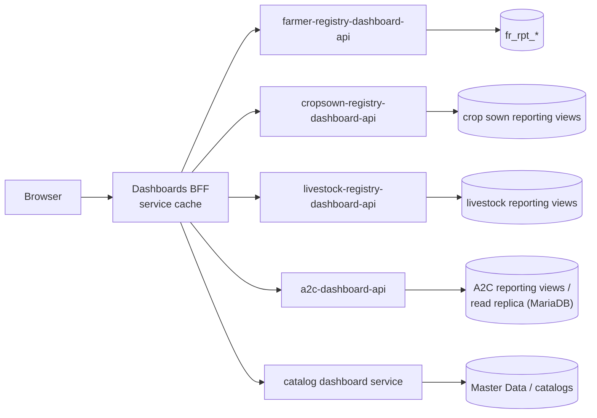

No database credentials remain in the dashboards; `DATABASE_URL` is removed.

### 14.3 Roadmap

| Phase | Work | Exit criterion |
| --- | --- | --- |
| **1. Farmer complete** | Move the remaining farmer panels to the farmer service; dedicated read-only DB role; NetworkPolicy; restrict `frame-ancestors`; fix the record-status tiles (`approved/rejected/pending` versus registry `ACTIVE…`) | No farmer chart ID left in `CHART_QUERIES` |
| **2. Crop sown and livestock services** | Add reporting views to each registry (the Helm `reportingViews.generate` option already generates mechanical views); build `*-dashboard-api` from the farmer template (filters dependency, `build_where_clause`, contract tests); deploy in each registry's release; register in `DASHBOARD_SERVICES` | Crop and Livestock views served live; their transitional tables dropped |
| **3. A2C dashboard service** | Define A2C reporting views or a read replica; map statuses to one dashboard vocabulary; map locations to P-codes; implement the `a2c*` chart IDs with the `provider` filter; aggregates only | A2C dashboard shows live data; `a2c_*` sample tables dropped |
| **4. Catalogs and DevOps** | Serve catalogs from Master Data or a catalog service; DevOps from monitoring sources | `DATABASE_URL` removed from the dashboards |
| **5. Hardening** | Minimum cell size; authentication at the ingress; shared cache if replicas grow; SLOs and alerts | Ready for wider access |

### 14.4 Template for a new dashboard service

1. Create reporting views in the source system (one row per entity at each grain you count), with
   position-based geography and a scheduled `REFRESH … CONCURRENTLY`.
2. Copy the farmer service: `ChartFilters`, `build_where_clause`, one handler per chart,
   `/health`, contract tests for every chart's keys, injection tests.
3. Deploy it in the source system's Helm release: ClusterIP only, secret DSN for a read-only role,
   readiness on `/health`, liveness on the TCP port.
4. Add it to `DASHBOARD_SERVICES` with its filters and chart IDs; set its URL variable in each
   environment.
5. Label new codes in `registry-data.ts`; delete the transitional SQL for those IDs.

For A2C the filters differ: `provider` joins the geography filters, and `farmingType` and
`recordState` do not apply. Declare exactly the filters the service accepts, so that the others do
not split its cache.

---

## 15. Risks, gaps and open questions

| # | Item | Impact | Proposed action |
| --- | --- | --- | --- |
| 1 | The dashboards have no authentication and allow framing from any origin | Anyone who can reach the URL sees national statistics | Keycloak at the ingress or portal; restrict `frame-ancestors`; narrow the BFF's open `cors()` |
| 2 | The dashboard service uses the registry's own DB user | More privilege than needed | Create `dashboard_ro` with `SELECT` on `fr_rpt_*` only |
| 3 | No small-count suppression | Re-identification risk if the dashboards open up | Minimum cell size in each service |
| 4 | Record-status tiles expect `approved/rejected/pending`; the registry uses `ACTIVE`… | Tiles show 0 | Label registry statuses instead of expecting fixed ones |
| 5 | A2C panels show sample data; status and location vocabularies differ from the backend | The A2C dashboard does not reflect reality | Phase 3; agree the status mapping (dashboard, `status` field, workflow archetype) |
| 6 | A2C consent calls an OpenG2P endpoint using a session login (`/web/session/authenticate`, `/consent/*`) while the gen2 registries expose consent through commons-services (Consent Manager, partner API) | A2C may point at a different OpenG2P deployment from the farmer registry that the dashboards count | Confirm which farmer registry A2C consents against, and align on the gen2 consent API |
| 7 | Crop sown and livestock registries have their own `dashboard-ui` that reads their database directly | Two dashboard paths, and DB credentials in a UI | Point those UIs at the new dashboard services too, or retire them in favour of the OAN Dashboards |
| 8 | A dashboard-api push does not deploy by itself; it rides on the next farmer-registry build | Forgotten deploys | Trigger the farmer-registry job from the dashboard-api repository, or document the step in its PR template |
| 9 | Per-process cache | Load scales with dashboard replicas | Shared cache if replicas exceed a few |
| 10 | `household_heads`, PSNP and import status have no registry source | Empty indicators | Add them to the reporting views when the registry models them |
| 11 | Some registry units are not in the map boundaries (special woredas, new units) | Shown in lists and totals, not as shapes | Refresh boundaries; keep list view |
| 12 | Kong `key-auth` keys are not scoped per route | One partner's key opens the other webhook | Use ACL plugin groups per consumer |

---

## 16. Appendices

### 16.1 Transitional chart IDs (to migrate)

| Group | Chart IDs |
| --- | --- |
| Farmer (remaining) | `householdIncomeSources`, `farmersByAge`, `landOwnershipDistribution`, `landAreaByRegion`, `landStats`, `registrantsByRegion`, `registrantsByGender`, `demographyStats`, `farmerPopulationByRegion`, `genderByRegion`, `socioEconomicKpis`, `householdStatusByGenderRegion`, `farmersByAgeGroupGenderRegion`, `femaleFarmersByRegion`, `femaleHouseholdHeads`, `genderDistributionByFarmingType`, `landInfoStats`, `landOwnershipByType`, `landAreaByGender`, `recentRegistrations` |
| Crop | `cropKpis`, `cropAreaByCrop`, `cropAreaByRegion`, `cropAreaByZone`, `cropAreaByWoreda`, `cropAreaByKebele`, `cropTopWoredas` |
| Livestock | `livestockKpis`, `livestockBySpecies`, `livestockPopulationTrend`, `livestockTopWoredas` |
| Catalogs | `catalogKpis`, `catalogRegistrySources`, `catalogIntegrationFaults`, `catalogExternalIntegrations`, `catalogCropsByCategory`, `catalogTopCropsByVariety`, `catalogVarietyTimeline`, `catalogVarietySource`, `catalogBreedsBySpecies`, `catalogSeedDemandByClass`, `catalogSeedDemandByCrop`, `catalogLocationHierarchy`, `catalogLivestockRegistryStatus` |
| Access to Credit | `a2cKpis`, `a2cProviders`, `a2cLoansByRegion`, `a2cLoansByZone`, `a2cLoansByWoreda`, `a2cLoansByKebele`, `a2cLocationSummary`, `a2cApplicationStatus`, `a2cConsentStatus`, `a2cLoanProducts`, `a2cLoanTrend`, `a2cDataShares`, `a2cDataShareFaults`, `a2cDeclineReasons`, `a2cFilterProviders`, `a2cFilterLocations` |
| DevOps | `devopsKpis`, `devopsPlatforms`, `devopsInstanceStatus`, `devopsNodes`, `devopsClusters`, `devopsDatabases`, `devopsApiScope`, `devopsApiHotspots`, `devopsPipelines`, `devopsPipelineTrend`, `devopsDeployFrequency`, `devopsTraffic`, `devopsIncidents` |

Chart IDs also listed in `CHART_QUERIES` but served by the farmer service (for example
`farmerKpis`, `farmersByRegion`, `landTenureSplit`) never reach the transitional path, because the
service map is checked first. Their SQL entries should be deleted.

### 16.2 Filter mapping

| Sidebar | BFF parameter | Farmer service | Transitional SQL | A2C (transitional) |
| --- | --- | --- | --- | --- |
| Region / Zone / Woreda / Kebele | `region`, `zone`, `woreda`, `kebele` | `geo_1_id…geo_4_id`, code or level id | Converted to `g2p_*` integer ids | `region_pcode`, `zone_pcode`, `woreda_pcode` |
| Farming Type | `farmingType` | `main_farming_type` (farmer), `farming_type` (land) | Alias match | — |
| Record Status | `recordState` (or `state`) | `record_status`, default `ACTIVE` | Column map | — |
| Type of Farmer | `farmerType` | Not forwarded | Column map | — |
| Credit Provider | `provider` | Not forwarded | — | `a2c_credit_provider.id` |

### 16.3 Repository map

| Repository | Key paths |
| --- | --- |
| `oan_dashboards` | `server/elysia-app.ts`, `server/dashboard-services.ts`, `instrumentation.ts`, `lib/chart-queries.ts`, `components/registry/registry-data.ts`, `docs/` |
| `farmer-registry-dashboard-api` | `app/api/filters.py`, `app/api/routes/charts.py`, `tests/`, `docs/api-reference.md` |
| `farmer-registry` | `farmer-extension/`, `docker/db-seed/reporting_views.sql`, `helm/openg2p-farmer-registry/templates/dashboard-api.yaml`, `templates/reporting-views-refresh.yaml`, `Jenkinsfile`, `docs/deployment.md`, `docs/dashboard-api-deployment.md` |
| `cropsown-registry`, `livestock-registry` | `*-extension/`, `dashboard-ui/`, `helm/`, `Jenkinsfile` |
| `oan_a2c` | `oan_a2c/api/v1/{consent,farmer,seller}`, `webhook_consent_data.py`, `kong/`, `openapi/`, `docs/` |
| `OAN-Access-To-Credit-System` | `src/app/api/proxy`, `src/proxy.ts`, `src/features/*` |
